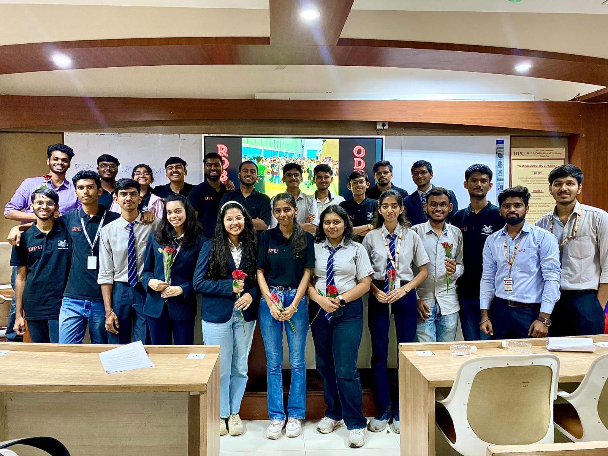
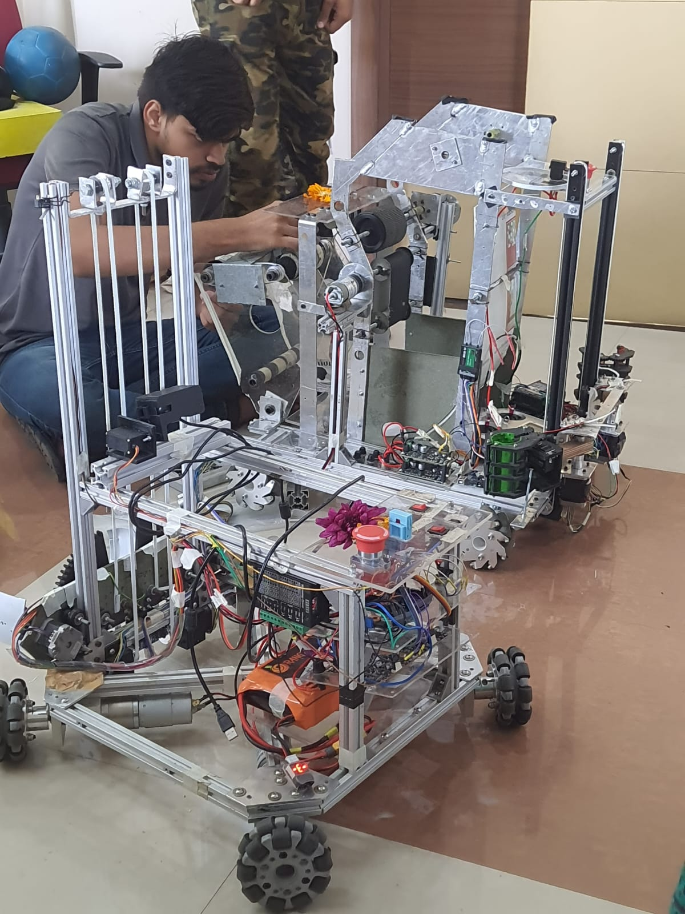
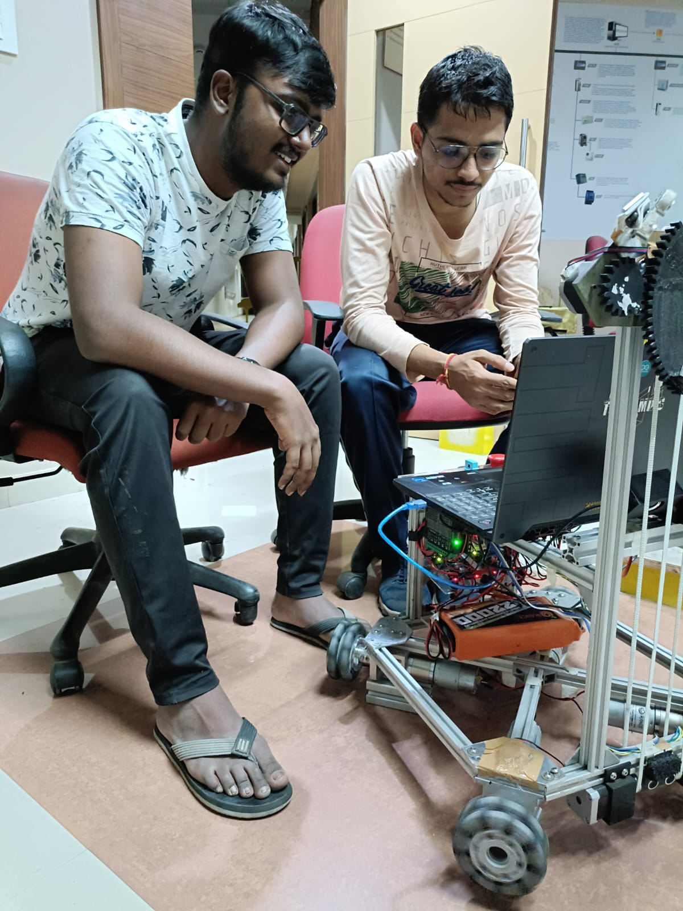

# Robocon 2024 Autonomous Bot by Team Raptors
(Dr. D. Y. Patil Institute of Technology, Pimpri, Pune)

Welcome to the Robocon Autonomous Bot project! This repository contains all the necessary code and documentation for the autonomous robot developed by Team Raptors from Dr. D.Y. Patil Institute of Technology for ABU Robocon 2024.

#### Creators


### You can download the models from the [Release page](https://github.com/shubhamprasad07/ABU-Robocon-2024-AutonomousBot--Team-Raptors/releases/tag/Yolov8-Models)

## Table of Content  
  * [Which files to use Explained](#Explaination)
  * [Introduction](#Introduction)
  * [Features](#Features)
  * [Hardware Requirements](#Hardware-Requirements)
  * [Software Requirements](#Software-Requirements)
  * [Installation](#Installation)
  * [File Structure](#File-Structure)
  * [Usage](#Usage)
  * [Contact](#Contact)

## Introduction
#### Autonomous Bot

His project showcases the autonomous bot designed for the ABU Robocon 2024 competition. The bot is capable of navigating the competition arena autonomously, performing tasks, and interacting with the environment as per the competition rules.

## Features
- Autonomous Navigation: Uses advanced algorithms for path planning and obstacle avoidance.
 - Task Execution: Equipped with mechanisms to perform specific tasks required by the competition.
 - Vision System: Implements YOLOv8 for object detection to recognize and interact with objects in the arena.
 - Communication: Utilizes wireless communication for real-time data exchange and coordination.



## Hardware Requirements
 - Arduino
 - Laptop with Nvidia GPU
 - Motors and Motor Drivers
 - Sensors (2 Ultrasonic, 2 Limit Switch)
 - Camera Module
 - Battery Pack
 - Other mechanical components as per the design


## Software Requirements
 - Window/Linux OS
 - Python 3.9
 - OpenCV
 - YOLOv8
 - Other dependencies listed in requirements.txt


## Installation
Clone the repository:
```bash
  git clone https://github.com/shubhamprasad07/ABU-Robocon-2024-AutonomousBot--Team-Raptors.git
```
 Or download zip file.
 
Install CUDA Toolkit:
```bash
  https://developer.nvidia.com/cuda-11-8-0-download-archive
```

Install the necessary dependencies:
```bash
  pip install -r requirements.txt
```

Install Cuda supported Torch
```
pip install torch torchvision torchaudio --index-url https://download.pytorch.org/whl/cu118
```

## File Structure
```bash
ABU-Robocon-2024-AutonomousBot--Team-Raptors/
├── Final/                     # Main code used in Robocon
│   ├── Integrated/            # Combined logic of Line following and Object pickup
│   ├── Seperate/              # Seperated functionalities of Line following and Object pickup
│   ├── Testing/               # Sensor Testing code
│   └── README.md 

├── Images/                    # Robocon Images and Videos

├── old_version/               # Old Code
│   ├── ObjectDetection/       # old object detection and following code
│   ├── color/                 # old color detection and following code
│   ├── linefollower/          # old line following code
│   └── README.md                  

├── requirements.txt           # Python dependencies
└── README.md                  # Project README
```
## Explaination 
  * [Integrated](Final/Integrated) has the files which can has both Line Following and Object Detection capability.
  * [Seperate](Final/Seperate) has both functionalities seperated.
  * [Testing](Final/Testing) has testing tools for sensors.
  * [old_version](old_versions) has previous versions of the codes.

## Usage
Running the bot:

go to Final/Integrated/auto_line_following.py
```bash
  python auto_line_following.py
```

## Contact
For any questions or inquiries, please contact Shubham Prasad at shubhamprasad7777@gmail.com.


